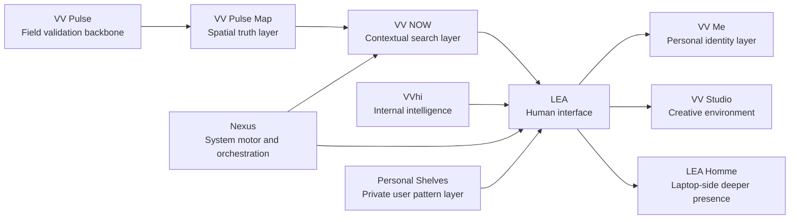

# VV Nexus

VV Nexus is the system core of the VV Hybrid Universe.

## What It Is

VV Nexus brings together the core surfaces, system pages, experiments and control layers that support the wider ecosystem.

This repository contains the current working center for:

- LEA surfaces
- VNEX web flows
- VV Pulse pages
- internal business and ecosystem views
- architecture and system documents

## Why It Exists

The VV Hybrid Universe is not a single page or a single assistant.
It is a connected system of products, interfaces and intelligence layers.

VV Nexus exists to hold the core of that system in one place while products continue to separate into clearer public repositories.

## Current Scope

Key areas currently visible in this repository include:

- `lea-home.html`
- `lea-public.html`
- `vnex.html`
- `vv-pulse.html`
- `vv-ceo-panel.html`
- `VV_HYBRID_UNIVERSE.html`

For the current VNEX role framing, use:

- [`VNEX_USER_MODEL.md`](./VNEX_USER_MODEL.md)
- [`VNEX_GOVERNANCE_MODEL.md`](./VNEX_GOVERNANCE_MODEL.md)
- [`VNEX_OWNERSHIP_AND_ACCESS_RULES.md`](./VNEX_OWNERSHIP_AND_ACCESS_RULES.md)
- [`VNEX_LEGAL_SKELETON.md`](./VNEX_LEGAL_SKELETON.md)
- [`VNEX_MONETIZATION_V1.md`](./VNEX_MONETIZATION_V1.md)
- [`VNEX_MVP_STRUCTURE.md`](./VNEX_MVP_STRUCTURE.md)

## Core IP And Invention Record

This repository also contains core invention and framework documents that matter beyond product screens.

Start here:

- [`VV_INVENTIONS_INDEX.md`](./VV_INVENTIONS_INDEX.md)
- [`VV_LANGUAGE_SPEC.md`](./VV_LANGUAGE_SPEC.md)

These documents separate:

- the `VV Hi Framework` invention layer
- the internal architecture and founder logic
- the implementation files that already express parts of the system

## LEA Source Map

For the current LEA web implementation inside `vv-nexus`, use:

- [`LEA_SOURCE_MAP.md`](./LEA_SOURCE_MAP.md)
- [`VV_ECOSYSTEM_MODEL.md`](./VV_ECOSYSTEM_MODEL.md)
- [`STATUS.md`](./STATUS.md)
- [`PUBLIC_IP_BOUNDARY.md`](./PUBLIC_IP_BOUNDARY.md)

Current rule:

- repository root = canonical LEA source
- `lea/` = mirrored copy
- `VV LEA STUDIOS/` = divergent variant, not the main source of truth

## Ecosystem Diagram

## Repository Reading Guide

Use these files together:

- [`STATUS.md`](./STATUS.md) for active, beta, internal, transitional, and concept reading
- [`PUBLIC_IP_BOUNDARY.md`](./PUBLIC_IP_BOUNDARY.md) for the framework/product/public boundary
- [`VV_ECOSYSTEM_MODEL.md`](./VV_ECOSYSTEM_MODEL.md) for the system model
- [`LEA_SOURCE_MAP.md`](./LEA_SOURCE_MAP.md) for LEA source truth

## Status

Active core repository.

Parts of this repo are product-facing.
Parts are still internal, experimental or transitional.

## Part Of

VV Nexus is part of the `VV Hybrid Universe`.

Related repositories:

- [vv-hybrid-univers-manifesto](https://github.com/vv-technologies/vv-hybrid-univers-manifesto)
- [vv-hi-framework](https://github.com/vv-technologies/vv-hi-framework)
- [vv-technologies](https://github.com/vv-technologies/vv-technologies)
- [vv-lea](https://github.com/vv-technologies/vv-lea)
- [vv-pulse](https://github.com/vv-technologies/vv-pulse)
- [vv-team](https://github.com/vv-technologies/vv-team)
